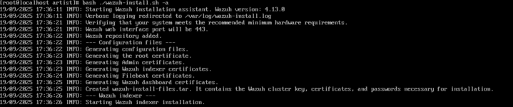

This whole process was draining. I wanted to use RHEL but my CPU that I have wasn't able to support RHEL 10 ([technology limits](https://access.redhat.com/articles/rhel-limits)) so I went with RHEL 8. That process went smoothly but Wazuh was a different story, the installation was hanging on the indexer.

I turned the firewall off with the 'systemctl stop firewalld' command and it did not work. Tried the firewall back on so I could ping to [packages.wazuh.com](http://packages.wazuh.com/) and that worked so it wasn't a connection issue. Decided to do a yum update && yum cleanup all and still the installation did not work. The first time running the installation, it failed with an error with 'all mirrors were tried without success' in the logs. 

Created an issue on Wazuh's [GitHub](https://github.com/wazuh/wazuh/issues/32054) repo and messaged their Slack channel. In the Github issue I was told it was a known issue and to do two solutions which I did and it didn't work so I went ahead and used the [Proxmox helper script](https://community-scripts.github.io/ProxmoxVE/scripts?id=wazuh&category=Monitoring+%26+Analytics) which worked fine.