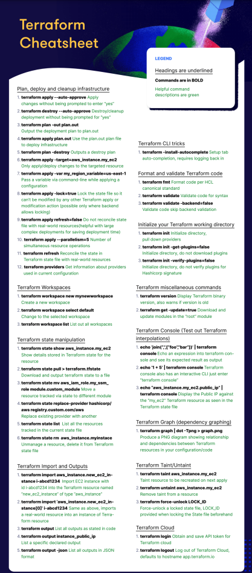

---
tags:
  - Infrastructure as Code
  - DevOps
---

## CLI Commands

Terraform is driven entirely from the command line. Here's a reference of the most common commands and flags.

### Core Workflow

| Command | Description |
|---|---|
| `terraform init` | Initializes the working directory. Downloads providers and modules. **Always run this first** or after adding new providers/modules. |
| `terraform plan` | Previews what Terraform *will* do without making any changes. Get in the habit of always reading this carefully. |
| `terraform apply` | Applies the changes described in the plan. Will prompt for confirmation unless you pass `-auto-approve` (use that flag carefully). |
| `terraform destroy` | Destroys all managed infrastructure. Essentially runs a plan in reverse. |

> **Tip:** Never run `apply` or `destroy` in production without first reviewing `plan` output. Terraform will tell you exactly how many resources will be added, changed, or destroyed. Treat that number as a sanity check.

### Useful Flags

| Command | Description |
|---|---|
| `terraform version` | Prints the installed Terraform version. Useful when debugging environment issues. |
| `terraform -chdir=<path>` | Runs a subcommand as if you were in `<path>`. Useful for scripting or running Terraform outside the working directory. |
| `terraform plan -out <plan_name>` | Saves the plan to a file. Use with `terraform apply <plan_name>` to guarantee exactly what was reviewed gets applied, no surprises between plan and apply. |
| `terraform plan -destroy` | Generates a preview of what `destroy` would do, without destroying anything. |
| `terraform apply <plan_name>` | Applies a previously saved plan file. |
| `terraform apply -target=<resource>` | Only applies changes to a specific resource. Useful for surgical fixes, but **avoid making it a habit** it can leave your state out of sync with your config. |
| `terraform apply -var my_variable=<value>` | Passes a variable at runtime via the command line. |
| `terraform providers` | Lists all providers used in the current configuration. |

---

## Core Concepts

### Configuration Language

Terraform uses **HCL (HashiCorp Configuration Language)**. Its main purpose is to declare the desired state of your infrastructure, not to write imperative scripts. Terraform figures out *how* to get there.

- **Blocks** — Containers for configuration objects (e.g., `resource`, `variable`, `output`). They have a type, optional labels, and a body.
- **Arguments** — Key-value pairs inside a block that assign a value to a name (e.g., `location = "eastus"`).
- **Expressions** — Anything that produces a value. This includes literals (`"hello"`), references (`var.name`), and function calls (`length(var.list)`).
- **Identifiers** — Names for things like arguments, block types, resources, and variables. Must start with a letter or underscore, and can contain letters, digits, underscores, and dashes.

### Comments

```hcl
# Single-line comment (preferred style)
// Also a single-line comment
/* Multi-line
   comment */
```

> **Tip:** Use `#` for inline comments. It's the idiomatic Terraform style. Save `/* */` for temporarily commenting out large blocks during debugging.

---

## Modules

A **module** is a collection of `.tf` and/or `.tf.json` files in a single directory. Every Terraform configuration is technically a module, the one you run commands from is called the **root module**.

Key rules:
- A module consists of only the **top-level** `.tf` files in a directory.
- **Nested directories are separate modules** and are not automatically included, you have to explicitly call them with a `module` block.
- Modules are how you reuse and organize Terraform code. Think of them like functions, they take inputs (variables), do work, and return outputs.

> **Tip:** Don't let your root module become a dumping ground. As your config grows, break it into modules by concern (networking, compute, storage). This makes it easier to test, reuse, and reason about.

---

## Resources

Resource blocks are the core of Terraform. They describe infrastructure objects (virtual networks, compute instances, DNS records, storage buckets, etc.)

```hcl
resource "azurerm_resource_group" "example" {
  name     = "my-resource-group"
  location = "East US"
}
```

The structure is: `resource "<provider_type>" "<local_name>" { ... }`

- `<provider_type>` — The resource type defined by a provider (e.g., `azurerm_resource_group`, `aws_instance`).
- `<local_name>` — A name you choose to reference this resource elsewhere in your config.

### Providers

Providers are **plugins** that allow Terraform to interact with external APIs (Azure, AWS, GCP, Kubernetes, GitHub, etc.) Each provider exposes a set of resource types and their available arguments. Always check the provider's documentation; it defines exactly what arguments each resource accepts and which are required vs. optional.

> **Tip:** Pin your provider versions in a `required_providers` block. Unpinned providers can introduce breaking changes when a new version is released.

```hcl
terraform {
  required_providers {
    azurerm = {
      source  = "hashicorp/azurerm"
      version = "~> 3.0"
    }
  }
}
```

### Meta-Arguments

Meta-arguments are special arguments you can use on **any** resource type to change its behavior. They are not provider-specific.

| Meta-Argument | Description |
|---|---|
| `depends_on` | Explicitly declares a dependency Terraform can't automatically detect. Use sparingly, if you need it often, it may signal a design problem. |
| `count` | Creates N instances of a resource. Access them via `resource_type.name[index]`. |
| `for_each` | Creates instances from a map or set of strings. More flexible than `count`, prefer it when instances have different configurations. |
| `provider` | Selects a non-default provider configuration. Useful when working with multiple regions or accounts. |
| `lifecycle` | Customizes resource lifecycle behavior (e.g., `create_before_destroy`, `prevent_destroy`, `ignore_changes`). |
| `provisioner` / `connection` | Runs scripts or commands after a resource is created. Use as a last resort. Terraform is declarative, and provisioners introduce imperative, hard-to-debug behavior. |

> **Tip on `count` vs `for_each`:** Use `count` when instances are identical. Use `for_each` when each instance has unique attributes. `for_each` is more robust, deleting a middle item in a `count` list causes everything after it to be recreated, which can be destructive.

### Timeouts

Some resource blocks support a nested `timeouts` block that lets you customize how long Terraform waits before failing an operation:

```hcl
resource "azurerm_virtual_machine" "example" {
  # ...
  timeouts {
    create = "60m"
    delete = "30m"
  }
}
```

---

## State

Terraform tracks all managed resources and their current real-world values in a **state file** (`terraform.tfstate`).

- The state is how Terraform knows what exists, what needs to change, and what to destroy.
- By default the state is stored locally, but in any team or production environment you should use **remote state** (e.g., Azure Blob Storage, AWS S3 + DynamoDB) so it's shared and locked.
- **Never manually edit the state file.** Use `terraform state` commands if you need to manipulate it.

> **Tip:** Add `terraform.tfstate` and `terraform.tfstate.backup` to your `.gitignore`. State files can contain sensitive values like passwords and keys in plaintext.

---

## Variables

Variables make your configurations reusable and avoid hardcoding values.

### Base Types

| Type | Example |
|---|---|
| `string` | `"East US"` |
| `number` | `3` |
| `bool` | `true` |

### Complex Types

| Type | Description |
|---|---|
| `list` | Ordered sequence of values, same type. |
| `set` | Like a list but unordered and no duplicates. |
| `map` | Key-value pairs, all values same type. |
| `object` | Like a map but each attribute can have a different type. |
| `tuple` | Like a list but each element can have a different type. |

> **Tip:** For most cases, `string`, `number`, `bool`, `list`, and `map` will cover you. Reach for `object` and `tuple` when you need structured, mixed-type inputs — common when designing reusable modules.

---

## Reference

- [Terraform Documentation](https://developer.hashicorp.com/terraform/docs)
- [Azure Terraform Docs](https://learn.microsoft.com/en-us/azure/developer/terraform/)
- [Azure AVD Log Analytics Workspace Example](https://docs.microsoft.com/en-us/azure/developer/terraform/create-avd-log-analytics-workspace)
- [Terraform Registry (Providers & Modules)](https://registry.terraform.io/)
- [https://docs.microsoft.com/en-us/azure/developer/terraform/create-avd-log-analytics-workspace](https://docs.microsoft.com/en-us/azure/developer/terraform/create-avd-log-analytics-workspace)

