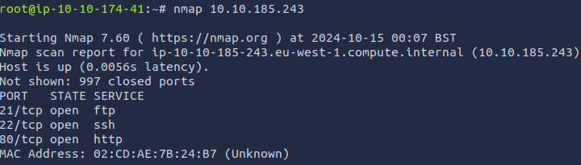

1. Do some recon using Nmap to see what's running and what ports are open.
	
	
2. So for this example I SSH into the FTP server and used anonymous if the FTP server supports anonymous logins to get through.

# Cloud Pentesting
Here's an overview of the tools commonly used in each step of attacking cloud environments:
### From your company

1. **Reconnaissance**: Tools like Nmap and Shodan are often used to scan for open ports and identify software versions[[1]](https://twodegrees1-my.sharepoint.com/personal/artist_thomas_slalom_com/Documents/Documents/Frameworks/NIST.CSWP.04162018.pdf?web=1).
2. **Initial Access**: Attackers might use Metasploit to exploit vulnerabilities or phishing kits to trick users into revealing credentials[[1]](https://twodegrees1-my.sharepoint.com/personal/artist_thomas_slalom_com/Documents/Documents/Frameworks/NIST.CSWP.04162018.pdf?web=1).
3. **Privilege Escalation**: Tools like Mimikatz can be used to extract credentials and escalate privileges[[1]](https://twodegrees1-my.sharepoint.com/personal/artist_thomas_slalom_com/Documents/Documents/Frameworks/NIST.CSWP.04162018.pdf?web=1).
4. **Lateral Movement**: Attackers might use PsExec or PowerShell scripts to move laterally within the network[[1]](https://twodegrees1-my.sharepoint.com/personal/artist_thomas_slalom_com/Documents/Documents/Frameworks/NIST.CSWP.04162018.pdf?web=1).
5. **Data Exfiltration**: Tools like Rclone or AWS CLI can be used to copy data to external servers[[1]](https://twodegrees1-my.sharepoint.com/personal/artist_thomas_slalom_com/Documents/Documents/Frameworks/NIST.CSWP.04162018.pdf?web=1).
6. **Persistence**: Attackers might use backdoors or create malicious scripts to maintain access. Tools like Cobalt Strike can be used for this purpose[[1]](https://twodegrees1-my.sharepoint.com/personal/artist_thomas_slalom_com/Documents/Documents/Frameworks/NIST.CSWP.04162018.pdf?web=1).
7. **Covering Tracks**: Attackers might use tools like CCleaner to delete logs and obfuscate their activities[[1]](https://twodegrees1-my.sharepoint.com/personal/artist_thomas_slalom_com/Documents/Documents/Frameworks/NIST.CSWP.04162018.pdf?web=1).
### From the Web

1. **Reconnaissance**: Tools like Nmap and Shodan are commonly used to gather information about the target cloud environment[[2]](https://www.eccouncil.org/cybersecurity-exchange/penetration-testing/cloud-penetration-testing/).
2. **Initial Access**: Metasploit and phishing kits are often used to gain initial access[[2]](https://www.eccouncil.org/cybersecurity-exchange/penetration-testing/cloud-penetration-testing/).
3. **Privilege Escalation**: Mimikatz is a popular tool for extracting credentials and escalating privileges[[2]](https://www.eccouncil.org/cybersecurity-exchange/penetration-testing/cloud-penetration-testing/).
4. **Lateral Movement**: PsExec and PowerShell scripts are commonly used for lateral movement[[2]](https://www.eccouncil.org/cybersecurity-exchange/penetration-testing/cloud-penetration-testing/).
5. **Data Exfiltration**: Tools like Rclone and AWS CLI are used to exfiltrate data[[2]](https://www.eccouncil.org/cybersecurity-exchange/penetration-testing/cloud-penetration-testing/).
6. **Persistence**: Cobalt Strike is often used to establish persistence[[2]](https://www.eccouncil.org/cybersecurity-exchange/penetration-testing/cloud-penetration-testing/).
7. **Covering Tracks**: CCleaner is a tool that can be used to cover tracks by deleting logs[[2]](https://www.eccouncil.org/cybersecurity-exchange/penetration-testing/cloud-penetration-testing/).
### References

[2] [What is Cloud Penetration Testing? Benefits, Tools, and Methods](https://www.eccouncil.org/cybersecurity-exchange/penetration-testing/cloud-penetration-testing/)